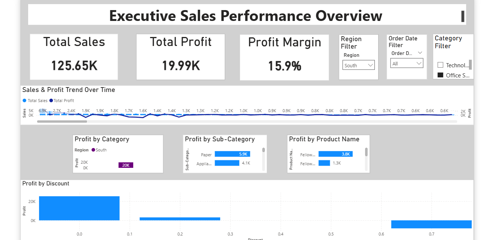

# Executive Sales Overview – Power BI Dashboard

## Project Overview
This project presents an interactive Power BI dashboard that analyzes sales performance, profit trends, and regional performance to support business decision-making.

## Key Insights
- Total Sales: 501.24K
- Total Profit: 39.71K
- Top 5 products identified by profit
- Regional sales comparison using slicers

## Dashboard Features
- Interactive filters for region
- Sales vs Profit trend analysis
- KPI cards for quick executive insights
- Top performing products visualization

## Tools Used
- Power BI
- Data Modeling
- DAX
- Data Visualization

## Dashboard Preview

